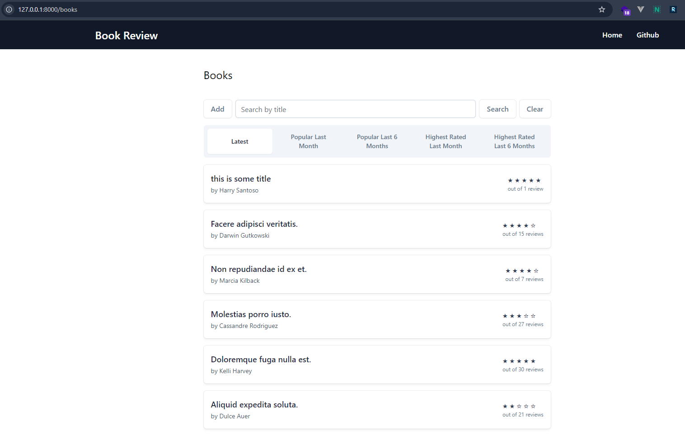
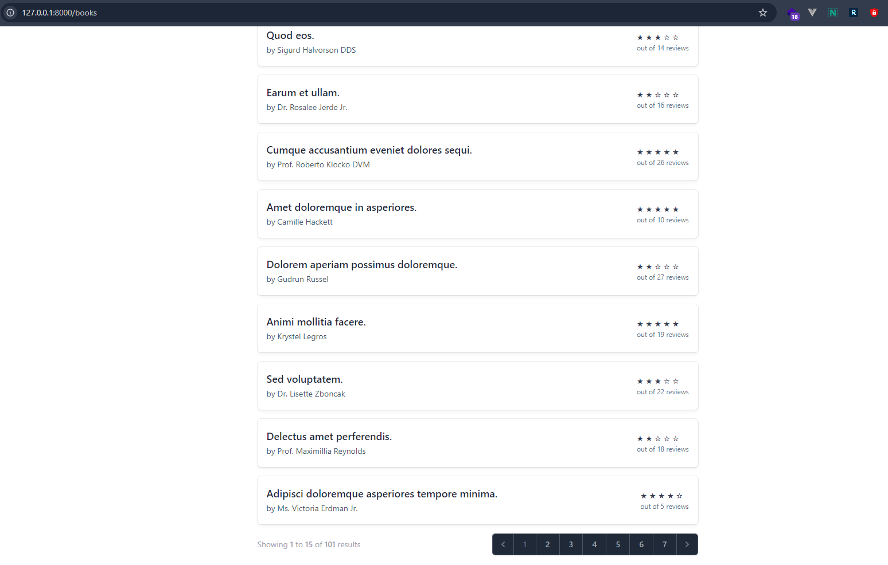
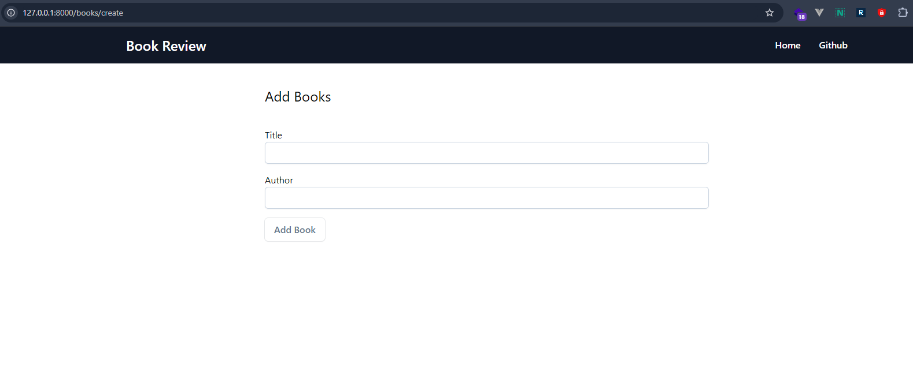
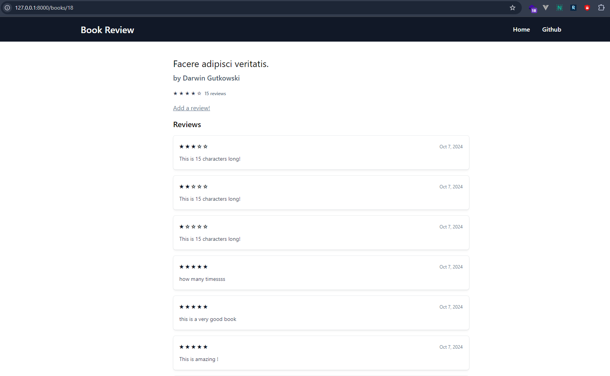
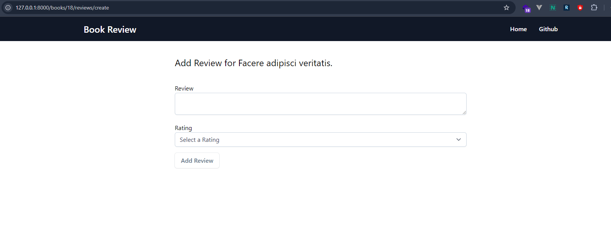

# Book Review Project

This is a Laravel project for managing book reviews. The website allows users to add books (title and author) and reviews (review and rating). The project includes data seeding, caching, and rate limiting for adding books and reviews.

## Features

- Add books with `title` and `author`
- Add reviews with `review` and `rating`
- Data seeding for books and reviews
- Rate limiting for adding books and reviews

  - Maximum of 5 books per hour
  - Maximum of 3 reviews per hour
- Caching using Memcache
- MySQL database integration

  

  

  

  

  

## Installation

1. Clone the repository:

   ```bash
   git clone https://github.com/your-username/book-review.git
   cd book-review
   ```
2. Install dependencies:

   ```
   composer install
   ```
3. Set up the `.env` file:

   ```
   cp .env.example .env
   ```

   Update the following variables in `.env`:

   ```
   DB_CONNECTION=mysql
   DB_HOST=127.0.0.1
   DB_PORT=3306
   DB_DATABASE=your_database
   DB_USERNAME=your_username
   DB_PASSWORD=your_password
   ```
4. Generate an application key:

   ```
   php artisan key:generate
   ```
5. Set up the database:

   ```
   php artisan migrate
   php artisan db:seed
   ```
6. Run the project:

   ```
   php artisan serve
   ```

## Requirements

* PHP >= 8.0
* Composer
* MySQL
* Laravel Framework 10.48.22

## License

This project is open-sourced software licensed under the [MIT license]().
